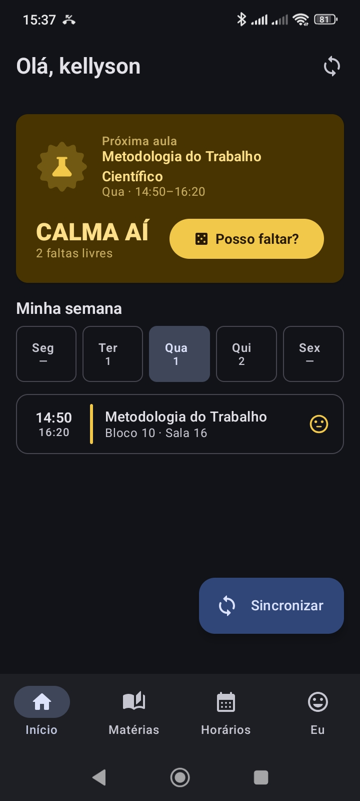
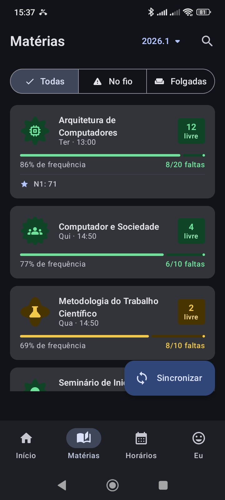
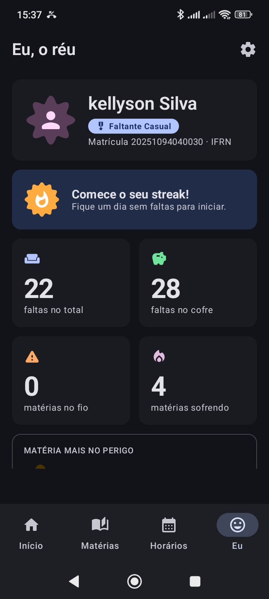

<div align="center">

# Supaco

**App Android não-oficial para o [SUAP](https://suap.ifrn.edu.br) do IFRN**

A pergunta que todo estudante faz — _"posso faltar hoje?"_ — respondida com os dados reais das suas faltas.

<br/>


<br/>

[](https://github.com/kellyson71/supaco-mobile/releases/latest)
[](https://github.com/kellyson71/supaco-mobile/actions/workflows/ci.yml)

</div>

---

## Baixar e instalar (Android)

O jeito mais simples é baixar o APK direto pelo celular:

1. Abra a página de **[Releases](https://github.com/kellyson71/supaco-mobile/releases/latest)** no navegador do seu celular
2. Na seção **Assets**, toque no arquivo **`supaco-vX.Y.apk`** para baixar
3. Abra o arquivo baixado (pela notificação ou pelo app de Arquivos)
4. Na primeira vez, o Android vai pedir para **permitir a instalação de fontes desconhecidas** — toque em **Configurações** e ative a permissão para o seu navegador/gerenciador de arquivos
5. Volte e toque em **Instalar**
6. Abra o app e faça login com sua **matrícula e senha do SUAP IFRN**

> Requer **Android 7.0+** (API 24). O APK tem cerca de **4 MB**.

> **Vindo da versão 1.x?** A 2.0 tem um novo identificador e uma nova assinatura. Desinstale a versão antiga antes de instalar a nova (seus dados voltam no primeiro login).

### É seguro?

Sim. Alguns pontos para você ter tranquilidade:

- **Código aberto** — todo o código está aqui no repositório, você pode auditar exatamente o que o app faz.
- **APK assinado** — cada release é assinado digitalmente com a mesma chave, então o Android garante que as atualizações vêm da mesma origem. Cada release traz o checksum SHA-256 do APK.
- **Sua senha não é guardada.** Ela vai uma única vez para o SUAP no login; o app guarda só o token de acesso, criptografado pelo Android Keystore. Notas e faltas ficam em cache local no aparelho e não entram no backup.
- **Comunicação direta com o SUAP** — o app fala apenas com a API oficial `suap.ifrn.edu.br`, por HTTPS. Não há intermediários.
- **Sem rastreadores, sem anúncios, sem analytics.** Veja a [política de privacidade](docs/PRIVACIDADE.md).

> O aviso de "fonte desconhecida" do Android é o padrão para qualquer app instalado fora da Play Store — não significa que o app é malicioso, apenas que não passou pela loja do Google.

---

## Telas

<sub>Uma amostra de algumas telas do app.</sub>

<div align="center">
<table>
  <tr>
    <td align="center" width="33%">
      <br/>
      <b>Início</b><br/>
      <sub>Veredito do dia + semana</sub>
    </td>
    <td align="center" width="33%">
      <br/>
      <b>Matérias</b><br/>
      <sub>Faltas e frequência por disciplina</sub>
    </td>
    <td align="center" width="33%">
      <br/>
      <b>Eu, o réu</b><br/>
      <sub>Estatísticas e conquistas</sub>
    </td>
  </tr>
</table>
</div>

### Widgets na tela inicial

<div align="center">
  <br/>
  <sub>Grade do dia, resumo de faltas e o veredito "posso faltar?"</sub>
</div>

---

## Funcionalidades

- **"Posso faltar hoje?"** — veredito baseado no seu saldo real de faltas, contando todas as aulas do dia
- **Cálculo de faltas em tempo real**, com frequência e limite por disciplina
- **Semáforo de risco** — verde (folgado), amarelo (no fio), vermelho (sofrendo)
- **Dashboard com 4 abas:** Início, Matérias, Horários e Perfil
- **3 widgets de tela inicial:** resumo de faltas, veredito rápido e grade da semana
- **Quick Settings Tile** — "posso faltar?" direto na barra de notificações
- **Alertas em segundo plano**: o app consulta o SUAP algumas vezes por dia e avisa quando uma matéria fica perigosa
- **Material You** com cores dinâmicas do papel de parede + tema claro/escuro
- **Biometria** e armazenamento criptografado de credenciais
- **Cache offline** com Room — funciona mesmo sem internet
- **Conquistas e streaks** para gamificar (ou ironizar) suas faltas — ou ative o **modo sério** para mensagens neutras
- **Busca de servidores** do campus

---

## Stack

| Camada | Tecnologia |
|--------|-----------|
| **UI** | Jetpack Compose + Material 3 |
| **Navegação** | Navigation Compose |
| **DI** | Koin |
| **Rede** | Retrofit + OkHttp |
| **Banco local** | Room |
| **Widgets** | Glance AppWidget |
| **Background** | WorkManager |
| **Segurança** | EncryptedSharedPreferences + Biometric |
| **Serialização** | Kotlin Serialization |

---

## Estrutura do projeto

```
app/src/main/java/io/github/kellyson71/supaco/
├── data/
│   ├── model/          # Data classes (Auth, Academic, Profile)
│   ├── remote/         # Retrofit API + interceptors
│   ├── local/          # Room DB, DAOs, EncryptedPrefs
│   ├── repository/     # Repositórios (Auth, Academic, Profile)
│   └── session/        # Ciclo de vida da sessão (login, logout, expiração)
├── di/                 # Módulos Koin
├── ui/
│   ├── auth/           # Tela de login
│   ├── dashboard/      # Dashboard principal + abas
│   ├── conquistas/     # Tela de conquistas
│   ├── settings/       # Tela de configurações
│   ├── main/           # MainScreen (entry point pós-login)
│   └── components/     # Componentes reutilizáveis
├── widget/             # Glance widgets
├── tile/               # Quick Settings Tile
├── notifications/      # WorkManager + Notifier
└── theme/              # Material Theme (Color, Type, Shape)
```

---

## Rodar a partir do código (desenvolvedores)

> Se você só quer usar o app, baixe o APK pela seção [Baixar e instalar](#baixar-e-instalar-android) acima.

Requisitos: **Android Studio Ladybug+** e **JDK 17**.

```bash
git clone https://github.com/kellyson71/supaco-mobile.git
cd supaco-mobile
./gradlew lintDebug testDebugUnitTest assembleDebug
```

Sem Android Studio, crie um `local.properties` com `sdk.dir=/caminho/do/Android/Sdk` (ou defina `ANDROID_HOME`).

### Gerar um release assinado

1. Copie `keystore.properties.example` para `keystore.properties` e preencha (o arquivo e o keystore ficam fora do git).
2. `./gradlew assembleRelease` → `app/build/outputs/apk/release/app-release.apk`

Sem `keystore.properties` (nem as variáveis `SUPACO_KEYSTORE_PATH`, `SUPACO_STORE_PASSWORD`, `SUPACO_KEY_ALIAS`, `SUPACO_KEY_PASSWORD`), o APK de release sai **sem assinatura**.

No GitHub, criar uma tag `vX.Y` dispara o workflow de release, que gera o APK assinado com os secrets do repositório e publica um rascunho de release com checksum.

> O app consome a API do SUAP em `suap.ifrn.edu.br`. Não é necessário nenhum token ou chave de terceiros.

---

## Contribuir

Veja [CONTRIBUTING.md](CONTRIBUTING.md). Falhas de segurança: [SECURITY.md](SECURITY.md). Histórico de versões: [CHANGELOG.md](CHANGELOG.md).

---

## Aviso

Projeto **não-oficial**, sem qualquer vínculo com o IFRN. Suas credenciais ficam **apenas no seu dispositivo**, criptografadas — nada é enviado para servidores de terceiros.

---

<div align="center">

Feito por [**@kellyson71**](https://github.com/kellyson71) · **Licença MIT**

</div>
